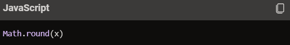

---

---

# What is method is JS?
## A method is a block of code which only runs when it is called. You can pass data, known as parameters, into a method. Methods are used to perform certain actions, and they are also known as functions.  

---

# What is String ?
## In JavaScript, a string is a data type used to represent and manipulate a sequence of characters. Strings are typically used to store text-based data, such as words, sentences, or any other text.

--- 

# Methods of String:
* charAt()
* at()
* concat()
* trim()
* includes()
* indexOf()
* replace(), replaceAll()
* repeat()
* slice()
* substring()
* split()
* toString()
* toLowerCase()
* toUpperCase()

---

1. CharAt() - the charAt() method in JavaScript is used to retrieve the character at a specified index within a string.

---

2. At() - It looks like you might be referring to the at() method in JavaScript, which is used to access an element at a specific index in a string or array.

--- 

3. Concat - the concat() method in JavaScript is used to merge two or more arrays or strings. This method does not change the existing arrays or strings but instead returns a new array or string.

---

4. Trim - the trim() method in JavaScript is used to remove whitespace from both ends of a string. This includes spaces, tabs, and newline characters. The method does not change the original string but returns a new string with the whitespace removed.

---

5. Includes - the includes() method in JavaScript is used to check if a string contains a specified substring or if an array contains a specified element.

---

6. IndexOf - the indexOf() method in JavaScript is used to find the position of the first occurrence of a specified value in a string or an array.

---

7. Replace - the replace() method in JavaScript is used to return a new string with some or all matches of a pattern replaced by a replacement. 

---

8. Repeat - the repeat() method in JavaScript is used to construct and return a new string which contains the specified number of copies of the string it was called on. 

---

9. Slice - the slice() method in JavaScript is used to extract a section of an array or string and return it as a new array or string, without modifying the original.

---

10. Substring - the substring() method in JavaScript is used to extract a portion of a string between two specified indices and return it as a new string. The original string remains unchanged.

---

11. Split - the split() method in JavaScript is used to divide a string into an array of substrings based on a specified separator. This method does not change the original string but returns a new array.

---

12. ToString - the toString() method in JavaScript is used to convert an object to a string representation. This method is available for various data types, including arrays, numbers, and objects.

---

13. ToLowerCase - the toLowerCase() method in JavaScript is used to convert all the characters in a string to lowercase. This method does not change the original string but returns a new string with all lowercase characters.

---

14. ToUpperCase() - the toUpperCase() method in JavaScript is used to convert all the characters in a string to uppercase. This method does not modify the original string but returns a new string with all uppercase characters.

---

# Methods of Number:
* Math.floor() 
* Math.round()
* Math.ceil() 
* max() 
* min()
* pow()
* sqrt()
* abs() 
* random()
* isNaN()

---

1. Math.floor() - the math.floor() method in JavaScript is used to round a number down to the nearest integer.

---

2. Math.round() - the math.round() method in JavaScript rounds a number to the nearest integer.

---

3. Math.ceil() - the math.ceil() method in JavaScript rounds a number up to the nearest integer.

--- 

4. Max() - the math.max() method in JavaScript returns the largest of the numbers given as input parameters.

---

5. Min() - the math.min() method in JavaScript returns the smallest of the numbers given as input parameters.

---

6. Pow() - the math.pow() method in JavaScript returns the value of a base number raised to a specified exponent. 

---

7. Sqrt() - the math.sqrt() method in JavaScript returns the square root of a number. 

---

8. Abs() - the math.abs() method in JavaScript returns the absolute value of a number, which is the non-negative value of the number without regard to its sign.

---

9. Random() - the math.random() method in JavaScript returns a floating-point, pseudo-random number between 0 (inclusive) and 1 (exclusive).

---

10. IsNaN() - the isNaN() method in JavaScript is used to determine whether a value is “Not-a-Number” (NaN).

---

